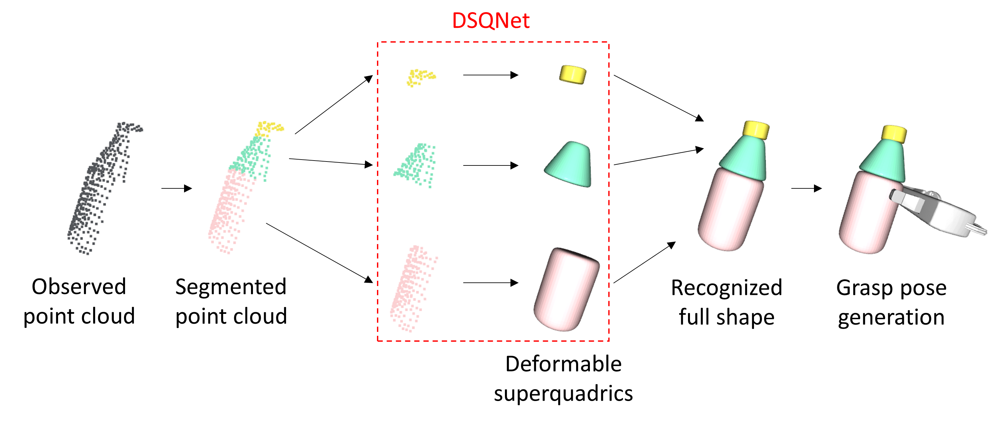

# DSQNet
The official repository for &lt;DSQNet: A Deformable Model-Based Supervised Learning Algorithm for Grasping Unknown Occluded Objects> (Seungyeon Kim<sup>\*</sup>, Taegyun Ahn<sup>\*</sup>, Yonghyeon Lee, Jihwan Kim, Michael Yu Wang, and Frank C. Park, T-ASE 2022).

<sup>\*</sup> The two lead co-authors contributed equally.

> The paper proposes a recognition-based grasping method that merges a richer set of shape primitives, the deformable superquadrics, with a deep learning network, DSQNet, that is trained to identify complete object shapes from partial point cloud data.



Paper: preparing  
Supplementary video: preparing

## Progress

- [ ] DSQNet and SQNet training script (`train.py`)
- [ ] Segmentation network training script (`train.py`)
- [x] Pre-trained model upload
- [ ] Data generation script (`data_generation.py`)
- [x] Dataset upload
- [ ] Evaluation script (`evaluation.py`)

## Requirements

### Environment
The project codes are tested in the following environment.

- python 3.7.9
- pytorch 1.6.0
- tensorboard 2.3.0

### Datasets
Datasets should be stored in `src/training/datasets/` directory. Datasets can be set up in one of two ways.
- Run the data generation script in `src/` directory:
```
python data_generation/data_generator.py
```

- Download through the [Google drive link](https://drive.google.com/drive/folders/1PQ9dSeD0WmdESQemsnM1SPmpPDChQ95s?usp=sharing)

When set up, the dataset directory should look like as follows.

```
datasets
├── primitive_dataset
│   ├── box
│   ├── ... (4 more folders)
│   ├── truncated_torus
│   ├── train_datalist.csv
│   ├── validation_datalist.csv
│   └── test_datalist.csv
└── object_dataset
    ├── bottle_cone
    ├── ... (10 more folders)
    ├── truncated_torus
    ├── train_datalist.csv
    ├── validation_datalist.csv
    └── test_datalist.csv

```

### (Optional) Pretrained model
Pre-trained models should be stored in `src/training/pretrained/`. The pre-trained models are provided through the [Google drive link](https://drive.google.com/drive/folders/1PN7DF0iNL60iOuyA-QS2g7jMzXSOPD6a?usp=sharing).
When set up, the pretrained directory should look like as follows.

```
pretrained
├── segnet
│   ├── segnet_config.yml
│   └── model_best.pkl
├── sqnet
│   ├── sqnet_config.yml
│   └── model_best.pkl
└── dsqnet
    ├── dsqnet_config.yml
    └── model_best.pkl
```

## Training
preparing...

## Evaluation
preparing...

## Citation
```
@article{temp,
  title={temp},
  author={temp},
  journal={temp},
  volume={temp},
  number={temp},
  pages={temp},
  year={temp},
  publisher={temp}
}
```


